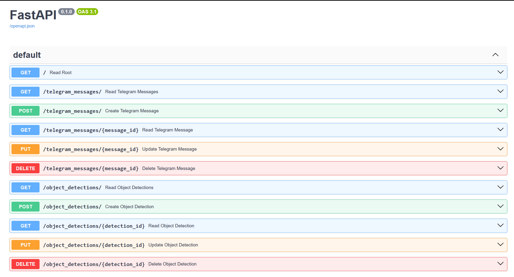
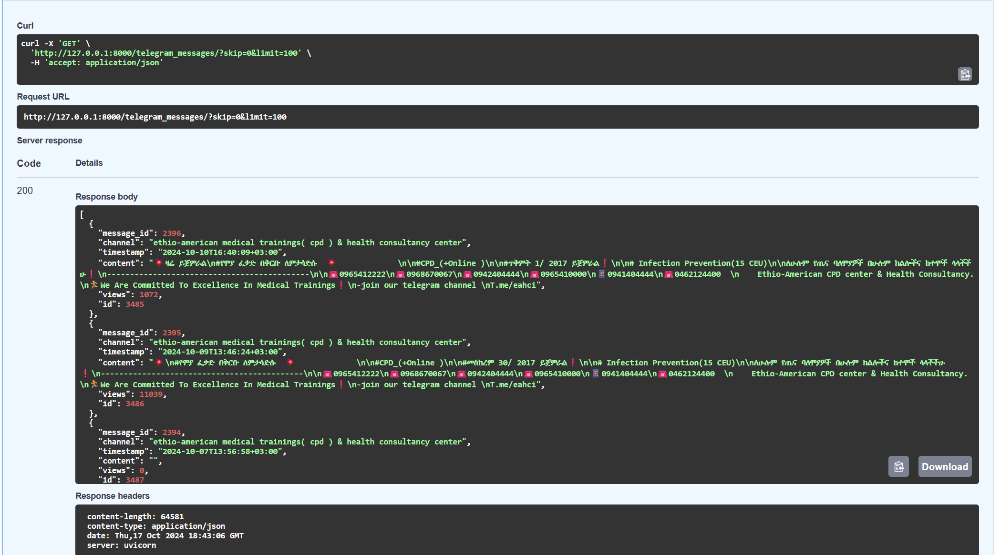

### FastAPI Endpoint

a FastAPI application that interacts with PostgreSQL database and provides endpoints to perform CRUD operation on the telegram messages and object detection results.

- Read all telegram messages 

- Read object detection

